# 💬 ConnectChat

A desktop real-time chat application built with **Python**, **TCP sockets**, **multithreading**, and a **Tkinter** GUI, using a Client–Server architecture.

> Developed as the final project for *Fundamentals of Networking* (COMP 3315) — University College of Applied Sciences.

<p align="center">
  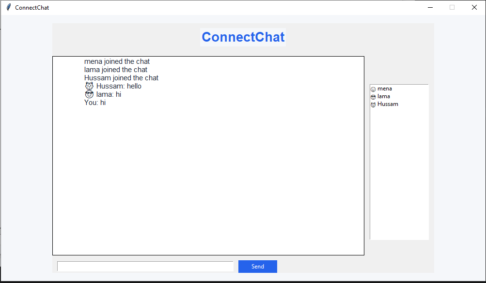
</p>

---

## ✨ Features

- 🔌 **TCP Client–Server communication** using Python's `socket` library
- 👥 **Multiple simultaneous clients** — one thread per client, so nobody blocks anyone else
- 📢 **Broadcast messaging** — a message is sent to all other connected clients (the sender doesn't get a duplicate)
- 🪪 **Username identification** — each socket is mapped to a username
- 🔔 **Join / leave notifications** shown to everyone in the chat
- 🔒 **Thread-safe shared state** — the connected-clients list is protected with `threading.Lock`
- 🛡️ **Exception handling** — sudden client disconnections are caught and the server keeps running for the others
- 🖥️ **Clean Tkinter GUI** — login screen, chat window, and a sidebar with the list of active users
- 🧱 **Separated layers** — networking logic is independent from the GUI (OOP design)

---

## 🖼️ Screenshots

| Login screen | Chat window |
|:---:|:---:|
| 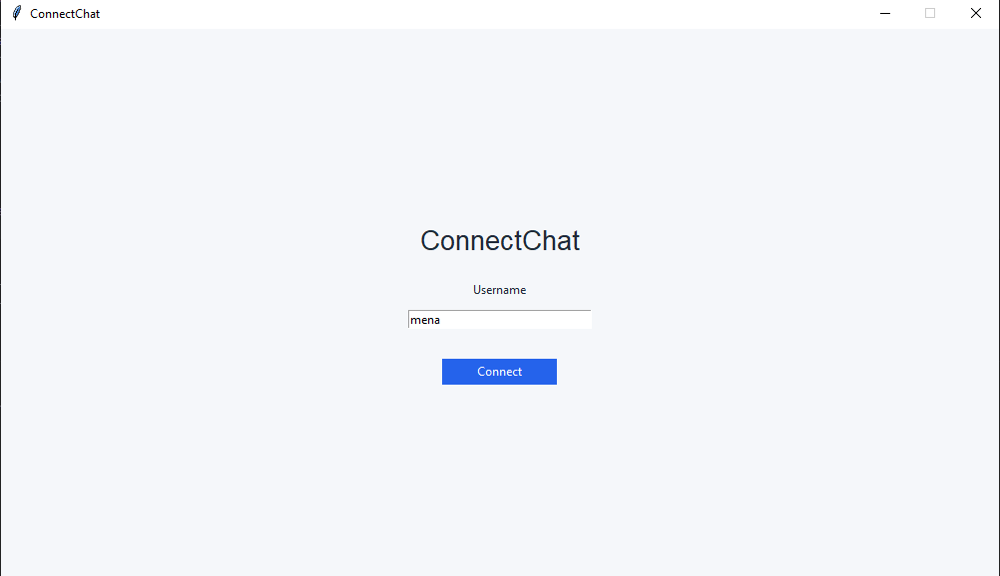 |  |

---

## 🏗️ Architecture

```
            ┌──────────────────────┐
            │  Server (Python TCP) │
            └──────────┬───────────┘
        ┌──────────────┼──────────────┐
        │              │              │
 ┌──────▼─────┐ ┌──────▼─────┐ ┌──────▼─────┐
 │ Client 1   │ │ Client 2   │ │ Client 3   │
 │ (Tkinter)  │ │ (Tkinter)  │ │ (Tkinter)  │
 └────────────┘ └────────────┘ └────────────┘
```

**Data flow:** `User → GUI → ChatClient → Socket → Server → Broadcast → Other Clients`

### Sequence diagram

<p align="center">
  
</p>

### Main classes

| Class | Responsibility |
|---|---|
| `ChatClient` | Owns the socket: `connect()`, `send_username()`, `send_message()`, `receive_messages()`, `close()` |
| `ChatGUI` | Tkinter interface: `create_login_frame()`, `create_chat_frame()`, `send_message()`, `display_message()`, `connect_to_server()` |

<p align="center">
  
</p>

---

## 📁 Project Structure

```
ConnectChat/
├── server/
│   └── server.py        # TCP server: accepts clients, one thread each, broadcast
├── client/
│   ├── client.py        # ChatClient: networking layer
│   └── gui.py           # ChatGUI: Tkinter interface
├── shared/
├── tests/
├── docs/
│   └── images/          # screenshots used in this README
└── README.md
```

---

## 🚀 Getting Started

### Requirements

- Python 3.9+ (developed with Python 3.14)
- Tkinter (included with the standard Python installer on Windows/macOS; on Linux: `sudo apt install python3-tk`)

No external packages are needed.

### Run

```bash
# 1. Clone the repository
git clone https://github.com/Mena444/ConnectChat.git
cd ConnectChat

# 2. Start the server FIRST (listens on 127.0.0.1:5000)
python server/server.py

# 3. In a new terminal, start a client (repeat for more users)
python client/gui.py
```

Enter a unique username on the login screen, press **Connect**, and start chatting. Open the client in several terminals to simulate multiple users.

> By default the server binds to `127.0.0.1:5000`. Change `HOST` and `PORT` in the server and client files to use a different address.

---

## 🧠 How It Works

1. The server creates a TCP socket, binds to `HOST:PORT`, and listens.
2. Each time a client connects, the server starts a **new thread** to handle it, while the main thread keeps accepting new connections.
3. The client sends its **username** first; the server maps socket → username and announces *"`<name>` joined the chat"*.
4. Every message is received by that client's thread and **broadcast** to all other sockets (skipping the sender).
5. Access to the shared clients list is guarded by a `threading.Lock` to avoid race conditions.
6. If a client drops unexpectedly, the exception is caught, the client is removed, others are notified, and the server continues.

---

## 🛠️ Development Journey

The project was built step by step, starting from a bare TCP connection in the terminal (no GUI) and ending with the full Tkinter application.

### Step 1 — First TCP connection

The server creates a socket, binds to `127.0.0.1:5000`, listens, and accepts a single client.

<p align="center">
  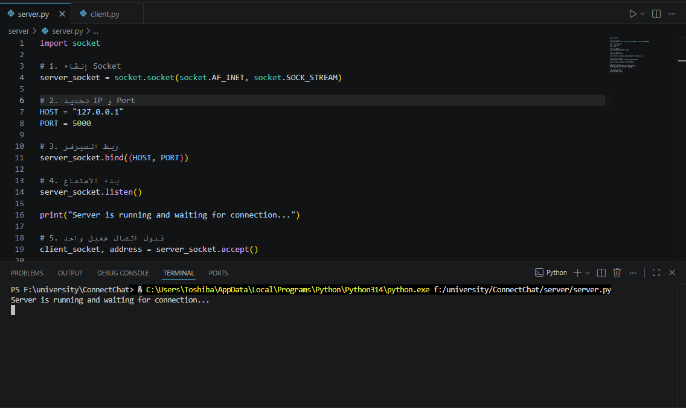
</p>

Keeping the server running and waiting for connections:

<p align="center">
  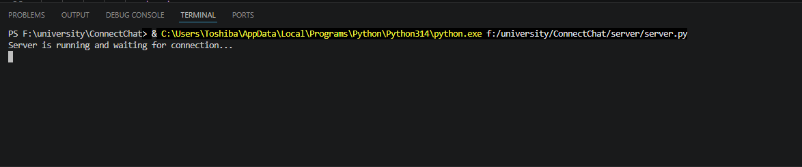
</p>

The client connects and sends its first message:

<p align="center">
  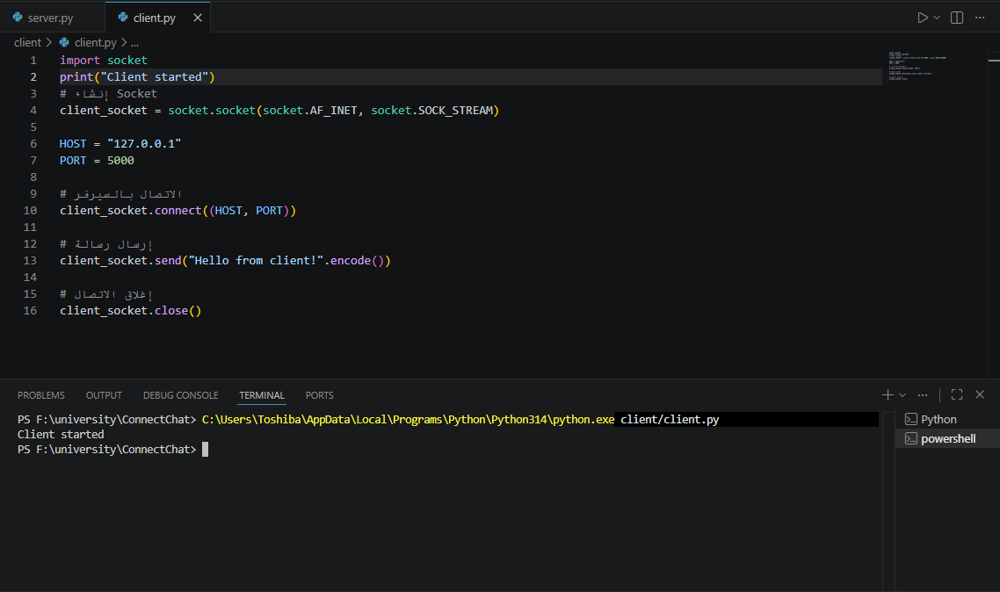
</p>

The server receives it:

<p align="center">
  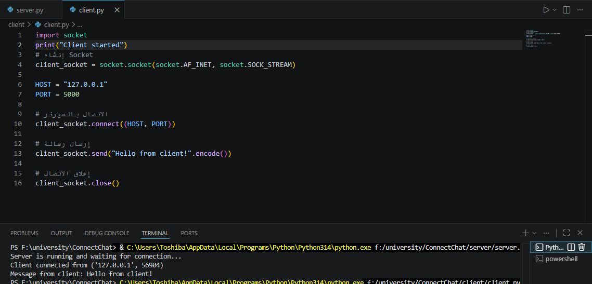
</p>

### Step 2 — First chat between client and server

A continuous receive loop lets the client and server exchange messages (the server shows the client's address and port).

| Server side | Client side |
|:---:|:---:|
| 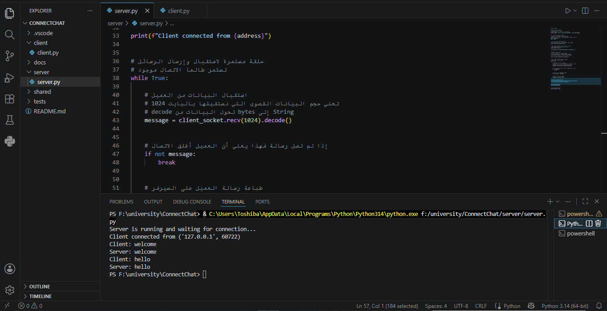 | 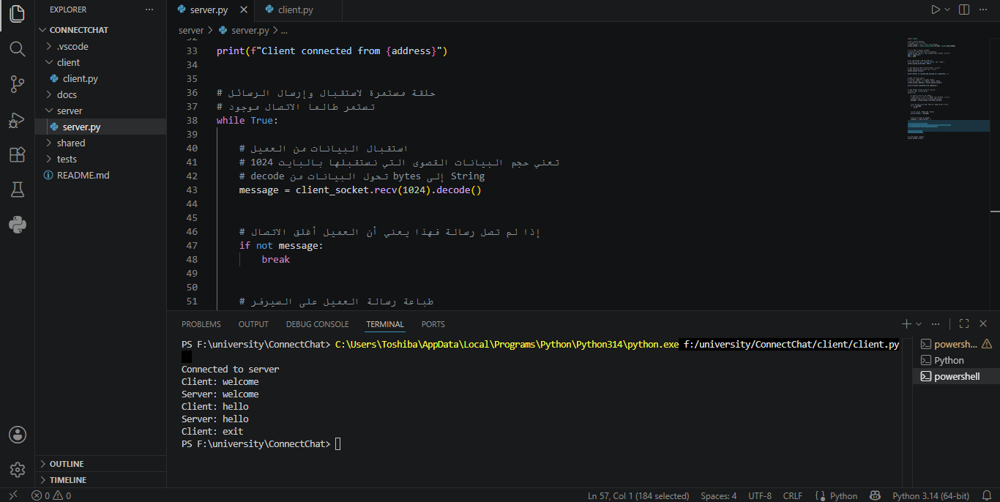 |

### Step 3 — Usernames and join events

The client now enters a username so the connection is no longer anonymous, and the chat announces *"`<name>` joined the chat"* (still single-threaded at this stage).

| Enter username | Join event |
|:---:|:---:|
| 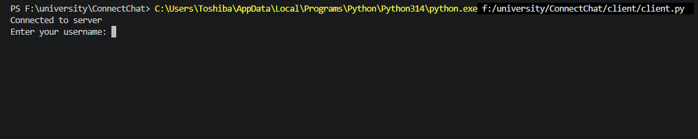 | 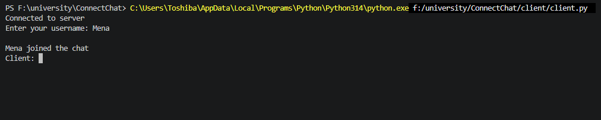 |

### Step 4 — Multiple clients with threads

After adding `threading`, several clients can chat at the same time. Messages are broadcast to everyone and the server shows each connection.

<p align="center">
  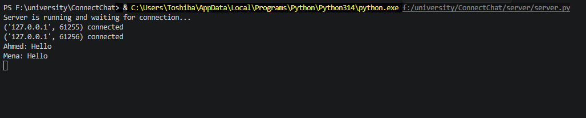
</p>

<p align="center">
  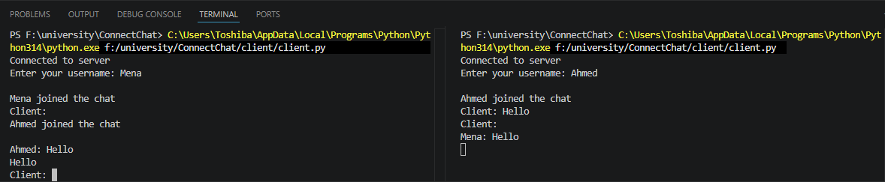
</p>

Join events are now visible to every connected client:

<p align="center">
  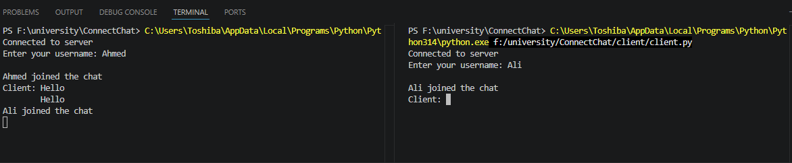
</p>

### Step 5 — Error handling

When a client closes suddenly, the server catches the error, prints which user/port was lost, and keeps running for everyone else.

<p align="center">
  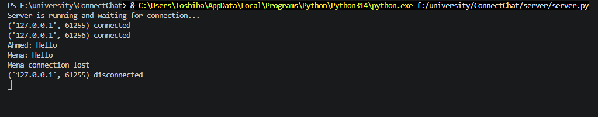
</p>

### Step 6 — Graphical interface

The terminal client was replaced by a Tkinter GUI with a login screen, a chat window, and an active-users sidebar (see the screenshots at the top).

---

## 🧗 Challenges & Solutions

| Challenge | Solution |
|---|---|
| Translating TCP theory into working `socket` code | Started with a minimal one-message client/server and traced with print statements |
| `ConnectionRefusedError` / server not ready | Strict startup order (server first), fixed `localhost` + port |
| Only one client at a time | One thread per client using the `threading` module |
| Race conditions on the clients list | `threading.Lock` around all reads/writes |
| Sender receiving its own message | `broadcast()` skips the sender's socket |
| Messages without sender names | Socket ↔ username mapping on the server |
| Server crashing on sudden disconnect | `try / except` around the receive loop + cleanup |

---

## 🛣️ Roadmap

- [x] Multi-client support with threads
- [x] Broadcast messaging & usernames
- [x] Join / leave notifications
- [x] Exception handling
- [x] Tkinter GUI with login screen
- [x] Connected users list
- [ ] Real-time refinement of the connected users list
- [ ] Handle more network-failure scenarios
- [ ] Deploy the server on a real host (public IP / cloud)

---

## 👩‍💻 Author

**Menna** — GitHub: [@Mena444](https://github.com/Mena444)

Course: Fundamentals of Networking (COMP 3315, Section 201) — Supervised by Dr. Fatima Abdulaziz.

---

## 📄 License

This project was developed as academic coursework at the **University College of Applied Sciences (UCAS)** and is provided for educational purposes only. Any reuse or redistribution is subject to the university's policies.
